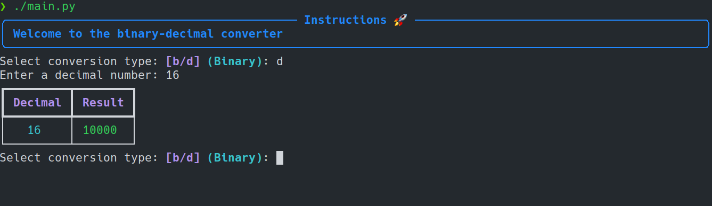

# Binary to decimal converter



## 🚀 Getting Started
Clone and execute the principal file

You will need:

- [Python3](https://www.python.org/downloads/).
- [Git](https://git-scm.com/).

1. [Fork](https://github.com/EduardYan/binary-to-decimal-python.git) this repository clone it locally:


```bash
git clone git@github.com:your_username/binary-to-decimal-python.git
```

2. Install dependencies from requirements file:

```bash
pip install -r requirements.txt
```

3. Now execute the principal file
```bash
# script
./main.py

# with python
python3 main.py
```


## 🔑 License

- [MIT](https://github.com/EduardYan/binary-to-decimal-python/blod/main/LICENSE).